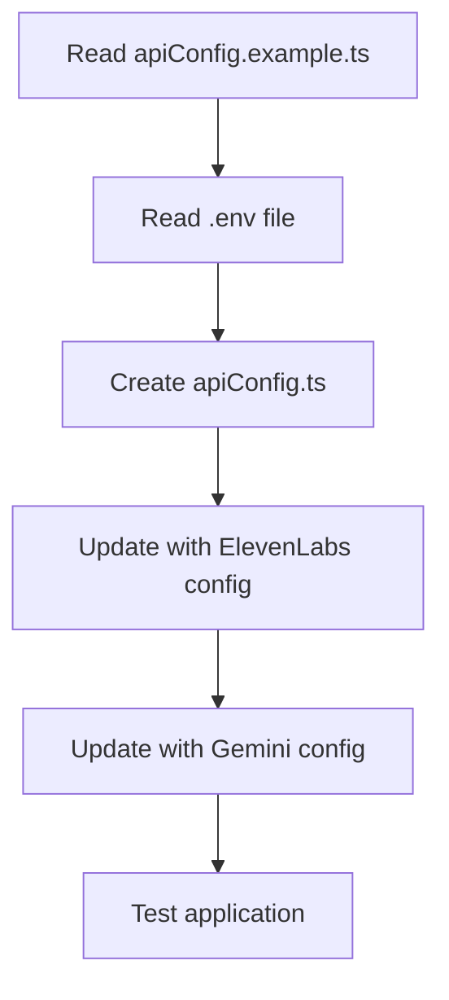

# API Configuration Update Plan

## Overview

This document outlines the plan for updating the `apiConfig.ts` file to fix the current errors in the Survival Companion application. The errors are related to missing imports of the `apiConfig` module in the Map components.

## Current Issues

1. Error in `./src/components/Map/EnhancedMapTab.tsx`: Module not found: Error: Can't resolve '../../config/apiConfig'
2. Error in `src/components/Map/MapTab.tsx`: Cannot find module '../../config/apiConfig' or its corresponding type declarations

## Root Cause Analysis

The application is trying to import the `apiConfig` module from `../../config/apiConfig`, but this file doesn't exist. There is an example file at `survival-companion/src/config/apiConfig.example.ts`, but the actual file needs to be created.

## Solution

Create the `apiConfig.ts` file based on the example file, incorporating environment variables from the `.env` file.



## Implementation Steps

### 1. Create the apiConfig.ts file

Create a new file at `survival-companion/src/config/apiConfig.ts` with the following content:

```typescript
// Configuration file for API keys and settings
// This file should be git ignored to prevent exposing sensitive information

const apiConfig = {
  openRouter: {
    apiKey: process.env.REACT_APP_OPENROUTER_API_KEY || 'YOUR_OPENROUTER_API_KEY',
    baseUrl: 'https://openrouter.ai/api/v1',
    defaultModel: 'anthropic/claude-3-opus'
  },
  elevenLabs: {
    apiKey: process.env.REACT_APP_ELEVENLABS_API_KEY || 'YOUR_ELEVENLABS_API_KEY',
    baseUrl: 'https://api.elevenlabs.io/v1',
    defaultVoice: 'JBFqnCBsd6RMkjVDRZzb', // Voice ID from the documentation
    textToSpeech: {
      streamEndpoint: '/text-to-speech/:voice_id/stream',
      defaultModel: 'eleven_multilingual_v2',
      outputFormat: 'mp3_44100_128'
    }
  },
  gemini: {
    apiKey: process.env.REACT_APP_GEMINI_API_KEY || 'YOUR_GEMINI_API_KEY',
    baseUrl: 'https://generativelanguage.googleapis.com/v1',
    defaultModel: 'gemini-pro'
  },
  openStreetMap: {
    tileUrl: 'https://{s}.tile.openstreetmap.org/{z}/{x}/{y}.png',
    attribution: '&copy; <a href="https://www.openstreetmap.org/copyright">OpenStreetMap</a> contributors',
    maxZoom: 19,
    center: [
      parseFloat(process.env.REACT_APP_MAP_DEFAULT_LAT || '28.0587'),
      parseFloat(process.env.REACT_APP_MAP_DEFAULT_LNG || '-82.4139')
    ] as [number, number],
    defaultZoom: parseInt(process.env.REACT_APP_MAP_DEFAULT_ZOOM || '15', 10)
  }
};

export default apiConfig;
```

### 2. Test the Application

After creating the `apiConfig.ts` file, run the application to verify that the errors are resolved:

```bash
cd survival-companion && npm start
```

### 3. Update .gitignore

Ensure that `apiConfig.ts` is added to the `.gitignore` file to prevent committing sensitive API keys:

```
# API configuration with sensitive keys
src/config/apiConfig.ts
```

## Future Considerations

1. **Environment Variables**:
   - Consider using a more secure method for managing API keys in production
   - Document the required environment variables in the README

2. **Type Safety**:
   - Add TypeScript interfaces for the API configuration
   - Add validation for required configuration values

3. **Error Handling**:
   - Add fallback mechanisms for when API keys are missing
   - Implement graceful degradation for features that require API access

## Conclusion

By implementing this plan, we will resolve the current errors related to the missing `apiConfig` module. This will allow the Map components to function correctly and set the stage for future integration of the ElevenLabs API for voice features.