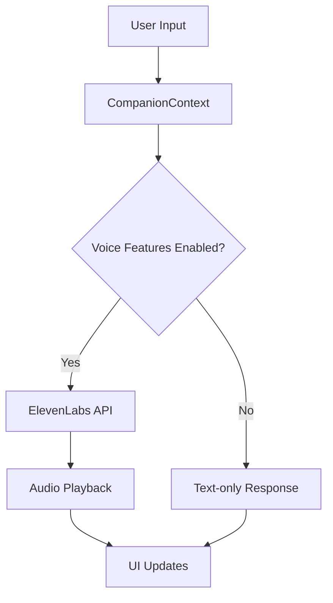

# ElevenLabs API Integration Plan

## Overview

This document outlines the plan for integrating the ElevenLabs Text-to-Speech API into the Survival Companion application. The integration will enable the AI assistant to communicate with users through voice, enhancing the immersive experience of the application.

## Current State

- The application has a feature flag `REACT_APP_ENABLE_VOICE_FEATURES=true` in the `.env` file
- There's an ElevenLabs API key configured in the `.env` file
- The `apiConfig.ts` file includes basic configuration for ElevenLabs
- No active implementation of voice features was found in the codebase

## Integration Architecture



## Implementation Plan

### 1. Update API Configuration

Enhance the `apiConfig.ts` file to include detailed configuration for the ElevenLabs API:

```typescript
elevenLabs: {
  apiKey: process.env.REACT_APP_ELEVENLABS_API_KEY || 'YOUR_ELEVENLABS_API_KEY',
  baseUrl: 'https://api.elevenlabs.io/v1',
  defaultVoice: 'JBFqnCBsd6RMkjVDRZzb', // Voice ID from the documentation
  textToSpeech: {
    streamEndpoint: '/text-to-speech/:voice_id/stream',
    defaultModel: 'eleven_multilingual_v2',
    outputFormat: 'mp3_44100_128'
  }
}
```

### 2. Create Voice Service

Create a new service to handle text-to-speech conversion:

```typescript
// src/services/VoiceService.ts
import apiConfig from '../config/apiConfig';

export class VoiceService {
  private static instance: VoiceService;
  private audio: HTMLAudioElement | null = null;
  
  private constructor() {}
  
  public static getInstance(): VoiceService {
    if (!VoiceService.instance) {
      VoiceService.instance = new VoiceService();
    }
    return VoiceService.instance;
  }
  
  public async speakText(text: string): Promise<void> {
    if (!process.env.REACT_APP_ENABLE_VOICE_FEATURES === 'true') {
      console.log('Voice features are disabled');
      return;
    }
    
    try {
      const response = await this.convertTextToSpeech(text);
      await this.playAudio(response);
    } catch (error) {
      console.error('Error speaking text:', error);
    }
  }
  
  private async convertTextToSpeech(text: string): Promise<Blob> {
    const voiceId = apiConfig.elevenLabs.defaultVoice;
    const url = `${apiConfig.elevenLabs.baseUrl}/text-to-speech/${voiceId}/stream`;
    
    const response = await fetch(url, {
      method: 'POST',
      headers: {
        'xi-api-key': apiConfig.elevenLabs.apiKey,
        'Content-Type': 'application/json'
      },
      body: JSON.stringify({
        text,
        model_id: apiConfig.elevenLabs.textToSpeech.defaultModel,
        output_format: apiConfig.elevenLabs.textToSpeech.outputFormat
      })
    });
    
    if (!response.ok) {
      throw new Error(`ElevenLabs API error: ${response.status}`);
    }
    
    return await response.blob();
  }
  
  private async playAudio(audioBlob: Blob): Promise<void> {
    // Stop any currently playing audio
    if (this.audio) {
      this.audio.pause();
      this.audio = null;
    }
    
    // Create a new audio element
    const audioUrl = URL.createObjectURL(audioBlob);
    this.audio = new Audio(audioUrl);
    
    // Play the audio
    return new Promise((resolve, reject) => {
      if (!this.audio) return reject('Audio not initialized');
      
      this.audio.onended = () => {
        URL.revokeObjectURL(audioUrl);
        resolve();
      };
      
      this.audio.onerror = (error) => {
        URL.revokeObjectURL(audioUrl);
        reject(error);
      };
      
      this.audio.play().catch(reject);
    });
  }
  
  public stopSpeaking(): void {
    if (this.audio) {
      this.audio.pause();
      this.audio = null;
    }
  }
}

export default VoiceService.getInstance();
```

### 3. Update CompanionContext

Modify the CompanionContext to use the VoiceService:

```typescript
// src/contexts/CompanionContext.tsx
import voiceService from '../services/VoiceService';

// Inside the sendMessage function
const sendMessage = useCallback(async (message: string) => {
  // Add user message
  const userMessage: Message = {
    role: 'user',
    content: message,
    timestamp: new Date().toISOString()
  };
  
  setMessages(prev => [...prev, userMessage]);
  setState('thinking');
  
  // Simulate processing delay
  setTimeout(async () => {
    // Generate response
    const responseText = getResponse(message);
    
    // Add assistant message
    const assistantMessage: Message = {
      role: 'assistant',
      content: responseText,
      timestamp: new Date().toISOString()
    };
    
    setMessages(prev => [...prev, assistantMessage]);
    setState('responding');
    
    // Speak the response if voice features are enabled
    if (process.env.REACT_APP_ENABLE_VOICE_FEATURES === 'true') {
      try {
        await voiceService.speakText(responseText);
      } catch (error) {
        console.error('Error speaking response:', error);
      }
    }
    
    setState('idle');
  }, 500);
}, []);
```

### 4. Add Voice Controls to UI

Add voice controls to the CompanionTab component:

```tsx
// src/components/Companion/CompanionTab.tsx
import voiceService from '../../services/VoiceService';

// Add state for voice enabled/disabled
const [isVoiceEnabled, setIsVoiceEnabled] = useState(
  process.env.REACT_APP_ENABLE_VOICE_FEATURES === 'true'
);

// Add toggle function
const toggleVoice = () => {
  if (!isVoiceEnabled) {
    setIsVoiceEnabled(true);
  } else {
    setIsVoiceEnabled(false);
    voiceService.stopSpeaking();
  }
};

// Add button to UI
<button
  className="button"
  onClick={toggleVoice}
  style={{
    backgroundColor: isVoiceEnabled ? 'var(--accent-color)' : 'var(--primary-color)',
    marginLeft: '0.5rem'
  }}
>
  {isVoiceEnabled ? 'Voice On' : 'Voice Off'}
</button>
```

### 5. Add Loading State for Voice

Update the CompanionAvatar component to show a "speaking" state:

```tsx
// src/components/Companion/CompanionAvatar.tsx
// Add a new state prop
interface CompanionAvatarProps {
  size?: 'small' | 'medium' | 'large';
  showStatus?: boolean;
  state?: 'idle' | 'thinking' | 'responding';
}

// Use the state to determine which animation to show
const getAnimationSrc = () => {
  switch (state) {
    case 'thinking':
      return '/assets/animations/Listening.gif';
    case 'responding':
      return '/assets/animations/Talking.gif';
    default:
      return '/assets/animations/Idle.gif';
  }
};
```

## Testing Plan

1. **Unit Tests**:
   - Test VoiceService methods with mocked API responses
   - Test CompanionContext with voice features enabled/disabled

2. **Integration Tests**:
   - Test the flow from user input to voice output
   - Test error handling when API calls fail

3. **Manual Testing**:
   - Test with valid and invalid API keys
   - Test with different text inputs
   - Test voice toggle functionality

## Deployment Considerations

1. **Environment Variables**:
   - Ensure the ElevenLabs API key is properly set in production environments
   - Consider using a different voice ID for production vs. development

2. **Performance**:
   - Monitor API usage and costs
   - Implement caching for frequently used phrases

3. **Accessibility**:
   - Ensure text alternatives are always available
   - Add visual indicators when voice is playing

## Future Enhancements

1. **Voice Selection**:
   - Allow users to choose from different voices
   - Customize voice parameters (speed, pitch, etc.)

2. **Offline Support**:
   - Cache common phrases for offline use
   - Implement a fallback for when the API is unavailable

3. **Voice Input**:
   - Add speech-to-text functionality for user input
   - Implement wake words for hands-free operation