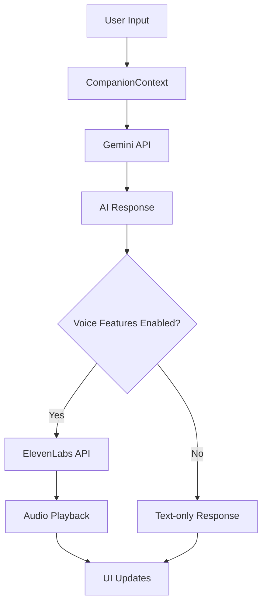

# Gemini API and ElevenLabs Integration Plan

## Overview

This document outlines the plan for integrating both the Google Gemini API (Flash 2.0 model) and the ElevenLabs Text-to-Speech API into the Survival Companion application. The integration will enable the AI assistant to generate responses using Gemini and then convert those responses to speech using ElevenLabs.

## Architecture



## Implementation Plan

### 1. Update API Configuration

Enhance the `apiConfig.ts` file to include detailed configuration for both the Gemini API and ElevenLabs API:

```typescript
// Configuration file for API keys and settings
// This file should be git ignored to prevent exposing sensitive information

const apiConfig = {
  openRouter: {
    apiKey: process.env.REACT_APP_OPENROUTER_API_KEY || 'YOUR_OPENROUTER_API_KEY',
    baseUrl: 'https://openrouter.ai/api/v1',
    defaultModel: 'anthropic/claude-3-opus'
  },
  elevenLabs: {
    apiKey: process.env.REACT_APP_ELEVENLABS_API_KEY || 'YOUR_ELEVENLABS_API_KEY',
    baseUrl: 'https://api.elevenlabs.io/v1',
    defaultVoice: 'JBFqnCBsd6RMkjVDRZzb', // Voice ID from the documentation
    textToSpeech: {
      streamEndpoint: '/text-to-speech/:voice_id/stream',
      defaultModel: 'eleven_multilingual_v2',
      outputFormat: 'mp3_44100_128'
    }
  },
  gemini: {
    apiKey: process.env.REACT_APP_GEMINI_API_KEY || 'YOUR_GEMINI_API_KEY',
    baseUrl: 'https://generativelanguage.googleapis.com/v1',
    defaultModel: 'gemini-pro-vision',
    flashModel: 'gemini-flash'
  },
  openStreetMap: {
    tileUrl: 'https://{s}.tile.openstreetmap.org/{z}/{x}/{y}.png',
    attribution: '&copy; <a href="https://www.openstreetmap.org/copyright">OpenStreetMap</a> contributors',
    maxZoom: 19,
    center: [
      parseFloat(process.env.REACT_APP_MAP_DEFAULT_LAT || '28.0587'),
      parseFloat(process.env.REACT_APP_MAP_DEFAULT_LNG || '-82.4139')
    ] as [number, number],
    defaultZoom: parseInt(process.env.REACT_APP_MAP_DEFAULT_ZOOM || '15', 10)
  }
};

export default apiConfig;
```

### 2. Create Gemini Service

Create a new service to handle interactions with the Gemini API:

```typescript
// src/services/GeminiService.ts
import apiConfig from '../config/apiConfig';

export class GeminiService {
  private static instance: GeminiService;
  
  private constructor() {}
  
  public static getInstance(): GeminiService {
    if (!GeminiService.instance) {
      GeminiService.instance = new GeminiService();
    }
    return GeminiService.instance;
  }
  
  public async generateResponse(prompt: string): Promise<string> {
    try {
      const response = await this.callGeminiAPI(prompt);
      return response;
    } catch (error) {
      console.error('Error generating response:', error);
      return 'I apologize, but I encountered an error while processing your request.';
    }
  }
  
  private async callGeminiAPI(prompt: string): Promise<string> {
    const url = `${apiConfig.gemini.baseUrl}/models/${apiConfig.gemini.flashModel}:generateContent?key=${apiConfig.gemini.apiKey}`;
    
    const response = await fetch(url, {
      method: 'POST',
      headers: {
        'Content-Type': 'application/json'
      },
      body: JSON.stringify({
        contents: [
          {
            parts: [
              {
                text: prompt
              }
            ]
          }
        ],
        generationConfig: {
          temperature: 0.7,
          topK: 40,
          topP: 0.95,
          maxOutputTokens: 1024
        }
      })
    });
    
    if (!response.ok) {
      throw new Error(`Gemini API error: ${response.status}`);
    }
    
    const data = await response.json();
    
    // Extract the generated text from the response
    if (data.candidates && data.candidates.length > 0 && 
        data.candidates[0].content && data.candidates[0].content.parts && 
        data.candidates[0].content.parts.length > 0) {
      return data.candidates[0].content.parts[0].text;
    }
    
    throw new Error('Unexpected response format from Gemini API');
  }
}

export default GeminiService.getInstance();
```

### 3. Create Voice Service

Create a new service to handle text-to-speech conversion:

```typescript
// src/services/VoiceService.ts
import apiConfig from '../config/apiConfig';

export class VoiceService {
  private static instance: VoiceService;
  private audio: HTMLAudioElement | null = null;
  
  private constructor() {}
  
  public static getInstance(): VoiceService {
    if (!VoiceService.instance) {
      VoiceService.instance = new VoiceService();
    }
    return VoiceService.instance;
  }
  
  public async speakText(text: string): Promise<void> {
    if (process.env.REACT_APP_ENABLE_VOICE_FEATURES !== 'true') {
      console.log('Voice features are disabled');
      return;
    }
    
    try {
      const response = await this.convertTextToSpeech(text);
      await this.playAudio(response);
    } catch (error) {
      console.error('Error speaking text:', error);
    }
  }
  
  private async convertTextToSpeech(text: string): Promise<Blob> {
    const voiceId = apiConfig.elevenLabs.defaultVoice;
    const url = `${apiConfig.elevenLabs.baseUrl}/text-to-speech/${voiceId}/stream`;
    
    const response = await fetch(url, {
      method: 'POST',
      headers: {
        'xi-api-key': apiConfig.elevenLabs.apiKey,
        'Content-Type': 'application/json'
      },
      body: JSON.stringify({
        text,
        model_id: apiConfig.elevenLabs.textToSpeech.defaultModel,
        output_format: apiConfig.elevenLabs.textToSpeech.outputFormat
      })
    });
    
    if (!response.ok) {
      throw new Error(`ElevenLabs API error: ${response.status}`);
    }
    
    return await response.blob();
  }
  
  private async playAudio(audioBlob: Blob): Promise<void> {
    // Stop any currently playing audio
    if (this.audio) {
      this.audio.pause();
      this.audio = null;
    }
    
    // Create a new audio element
    const audioUrl = URL.createObjectURL(audioBlob);
    this.audio = new Audio(audioUrl);
    
    // Play the audio
    return new Promise((resolve, reject) => {
      if (!this.audio) return reject('Audio not initialized');
      
      this.audio.onended = () => {
        URL.revokeObjectURL(audioUrl);
        resolve();
      };
      
      this.audio.onerror = (error) => {
        URL.revokeObjectURL(audioUrl);
        reject(error);
      };
      
      this.audio.play().catch(reject);
    });
  }
  
  public stopSpeaking(): void {
    if (this.audio) {
      this.audio.pause();
      this.audio = null;
    }
  }
}

export default VoiceService.getInstance();
```

### 4. Update CompanionContext

Modify the CompanionContext to use both the GeminiService and VoiceService:

```typescript
// src/contexts/CompanionContext.tsx
import React, { createContext, useState, useCallback, ReactNode } from 'react';
import geminiService from '../services/GeminiService';
import voiceService from '../services/VoiceService';

// Message interface
export interface Message {
  role: 'user' | 'assistant';
  content: string;
  timestamp: string;
}

// Context type
interface CompanionContextType {
  state: 'idle' | 'thinking' | 'responding';
  messages: Message[];
  sendMessage: (message: string) => void;
  triggerCompanionResponse: (event: string) => Promise<void>;
  clearConversation: () => void;
}

// Create context with default values
export const CompanionContext = createContext<CompanionContextType>({
  state: 'idle',
  messages: [],
  sendMessage: () => {},
  triggerCompanionResponse: async () => {},
  clearConversation: () => {}
});

// Provider component
export const CompanionProvider: React.FC<{children: ReactNode}> = ({ children }) => {
  const [state, setState] = useState<'idle' | 'thinking' | 'responding'>('idle');
  const [messages, setMessages] = useState<Message[]>([]);
  
  // Send a message and get a response
  const sendMessage = useCallback(async (message: string) => {
    // Add user message
    const userMessage: Message = {
      role: 'user',
      content: message,
      timestamp: new Date().toISOString()
    };
    
    setMessages(prev => [...prev, userMessage]);
    setState('thinking');
    
    try {
      // Generate response using Gemini API
      const responseText = await geminiService.generateResponse(message);
      
      // Add assistant message
      const assistantMessage: Message = {
        role: 'assistant',
        content: responseText,
        timestamp: new Date().toISOString()
      };
      
      setMessages(prev => [...prev, assistantMessage]);
      setState('responding');
      
      // Speak the response if voice features are enabled
      if (process.env.REACT_APP_ENABLE_VOICE_FEATURES === 'true') {
        try {
          await voiceService.speakText(responseText);
        } catch (error) {
          console.error('Error speaking response:', error);
        }
      }
      
      setState('idle');
    } catch (error) {
      console.error('Error processing message:', error);
      
      // Add error message
      const errorMessage: Message = {
        role: 'assistant',
        content: 'I apologize, but I encountered an error while processing your request.',
        timestamp: new Date().toISOString()
      };
      
      setMessages(prev => [...prev, errorMessage]);
      setState('idle');
    }
  }, []);
  
  // Clear conversation history
  const clearConversation = useCallback(() => {
    setMessages([]);
  }, []);
  
  // Trigger a companion response based on an event
  const triggerCompanionResponse = useCallback(async (event: string) => {
    // Parse the event
    const [eventType, eventData] = event.split(':');
    
    // Check if this is a valid event type we want to respond to
    switch (eventType) {
      case 'inventory_added':
      case 'inventory_removed':
      case 'inventory_updated':
      case 'trade_completed':
      case 'map_marker_added':
        // These are valid events we want to respond to
        break;
      default:
        return; // Don't respond to unknown events
    }
    
    setState('thinking');
    
    try {
      // Generate a response based on the event using Gemini
      const prompt = `The user has ${eventType.replace('_', ' ')} ${eventData}. Provide a brief, helpful response about this action in the context of a post-apocalyptic survival scenario.`;
      const responseText = await geminiService.generateResponse(prompt);
      
      // Add assistant message
      const assistantMessage: Message = {
        role: 'assistant',
        content: responseText,
        timestamp: new Date().toISOString()
      };
      
      setMessages(prev => [...prev, assistantMessage]);
      setState('responding');
      
      // Speak the response if voice features are enabled
      if (process.env.REACT_APP_ENABLE_VOICE_FEATURES === 'true') {
        try {
          await voiceService.speakText(responseText);
        } catch (error) {
          console.error('Error speaking response:', error);
        }
      }
      
      setState('idle');
    } catch (error) {
      console.error('Error generating event response:', error);
      setState('idle');
    }
  }, []);
  
  return (
    <CompanionContext.Provider value={{
      state,
      messages,
      sendMessage,
      clearConversation,
      triggerCompanionResponse
    }}>
      {children}
    </CompanionContext.Provider>
  );
};
```

### 5. Update CompanionTab Component

Modify the CompanionTab component to include voice controls:

```tsx
// src/components/Companion/CompanionTab.tsx
import React, { useState, useContext, useEffect } from 'react';
import { CompanionContext } from '../../contexts/CompanionContext';
import CompanionAvatar from './CompanionAvatar';
import MessageList from './MessageList';
import TextInput from './TextInput';
import AssistantInfo from './AssistantInfo';
import voiceService from '../../services/VoiceService';

const CompanionTab: React.FC = () => {
  const { state } = useContext(CompanionContext);
  const [error, setError] = useState<string | null>(null);
  const [isVoiceEnabled, setIsVoiceEnabled] = useState(
    process.env.REACT_APP_ENABLE_VOICE_FEATURES === 'true'
  );
  
  // Toggle voice features
  const toggleVoice = () => {
    if (!isVoiceEnabled) {
      setIsVoiceEnabled(true);
    } else {
      setIsVoiceEnabled(false);
      voiceService.stopSpeaking();
    }
  };
  
  // Update environment variable when voice is toggled
  useEffect(() => {
    if (isVoiceEnabled) {
      process.env.REACT_APP_ENABLE_VOICE_FEATURES = 'true';
    } else {
      process.env.REACT_APP_ENABLE_VOICE_FEATURES = 'false';
    }
  }, [isVoiceEnabled]);
  
  return (
    <div className="card">
      <h2 className="card-title">AI Assistant</h2>
      
      {error && (
        <div className="alert alert-danger" style={{
          backgroundColor: 'var(--danger-color)',
          color: 'var(--text-color)',
          padding: '0.5rem 1rem',
          borderRadius: '4px',
          marginBottom: '1rem'
        }}>
          {error}
        </div>
      )}
      
      <div className="flex" style={{ gap: '1rem' }}>
        <div className="companion-sidebar" style={{ flex: '0 0 200px' }}>
          <CompanionAvatar size="medium" showStatus={true} />
          
          <div className="companion-status mt-1" style={{
            padding: '0.5rem',
            backgroundColor: 'var(--primary-color)',
            borderRadius: '4px',
            fontSize: '0.8rem',
            textAlign: 'center'
          }}>
            <p>Status: <span className="text-accent">{state.charAt(0).toUpperCase() + state.slice(1)}</span></p>
            
            <button
              className="button mt-1"
              onClick={toggleVoice}
              style={{
                backgroundColor: isVoiceEnabled ? 'var(--accent-color)' : 'var(--primary-color)',
                border: isVoiceEnabled ? 'none' : '1px solid var(--border-color)',
                padding: '0.25rem 0.5rem',
                fontSize: '0.8rem',
                width: '100%'
              }}
            >
              {isVoiceEnabled ? 'Voice: ON' : 'Voice: OFF'}
            </button>
          </div>
        </div>
        
        <div className="companion-main" style={{ flex: '1' }}>
          <MessageList maxHeight="350px" />
          
          <div className="mt-1">
            <TextInput />
          </div>
          
          <div className="mt-1">
            <AssistantInfo />
          </div>
        </div>
      </div>
    </div>
  );
};

export default CompanionTab;
```

## Testing Plan

1. **Unit Tests**:
   - Test GeminiService methods with mocked API responses
   - Test VoiceService methods with mocked API responses
   - Test CompanionContext with both services mocked

2. **Integration Tests**:
   - Test the flow from user input to Gemini response to voice output
   - Test error handling when API calls fail

3. **Manual Testing**:
   - Test with valid and invalid API keys
   - Test with different text inputs
   - Test voice toggle functionality
   - Verify that the Gemini Flash 2.0 model is being used correctly

## Implementation Steps

1. Update `apiConfig.ts` to include both Gemini and ElevenLabs configurations
2. Create the GeminiService and VoiceService
3. Update the CompanionContext to use both services
4. Update the CompanionTab component to include voice controls
5. Test the integration

## Conclusion

This integration will enhance the Survival Companion application by:
1. Using the Gemini Flash 2.0 model for generating AI responses
2. Converting those responses to speech using the ElevenLabs API
3. Providing users with the ability to toggle voice features on/off

The result will be a more immersive and interactive experience for users of the application.