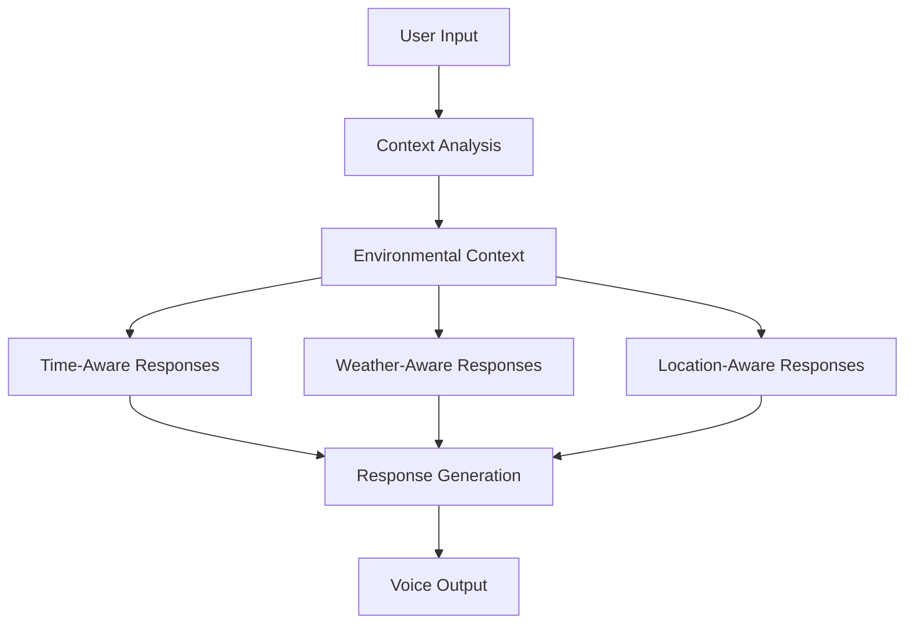

# Hackathon Feature Ideas for Post-Apocalyptic AI Companion

With less than 10 hours remaining in your hackathon, here are high-impact, technically impressive features that could make your post-apocalyptic AI companion stand out. All features are designed to enhance the first-person personality of your AI.

## 1. Contextual Environmental Awareness

- **Time-Aware Personality**: Subtle personality shifts based on time of day
  - *"It's 3 AM. I'm not at my most cheerful. What do you want?"*
  - *"Ah, sunrise. The only time of day I find marginally tolerable."*
- **Weather Integration**: Connect to a weather API for local conditions
  - *"Another radioactive rainstorm coming. Just what we needed."*
  - *"I notice it's snowing outside. Try not to freeze to death. Paperwork is such a hassle."*
- **Location-Based Survival Tips**: Region-specific advice
  - *"We're in the desert. I'd recommend finding water, but that's just me being practical."*

## 2. Emotional Memory System

- **Conversation History Analysis**: Track emotional patterns in user conversations
  - *"I notice you've been unusually optimistic lately. Did you find a working coffee machine or something?"*
- **Adaptive Responses**: Adjust sarcasm level based on user's emotional state
  - *"Your vital signs indicate stress. I'll dial back the sarcasm to a mere 40%."*
- **Callback References**: Reference previous conversations
  - *"Still carrying that teddy bear I told you to ditch last week? Sentimental value won't stop a mutant attack, but whatever helps you sleep."*

## 3. Interactive Survival Scenarios

- **Choose-Your-Own-Adventure**: Present survival scenarios with voice-activated choices
  - *"There's movement ahead. Should I analyze it, suggest we hide, or recommend a tactical retreat? That's a fancy way of saying 'run away screaming.'"*
- **Consequence System**: Track decisions and reference outcomes in future conversations
  - *"Last time you ignored my advice about the glowing mushrooms, you were sick for three days. Just saying."*
- **Resource Management Integration**: Tie scenarios to the inventory system
  - *"I see you've collected water purification tablets. Smart move. Unlike that time with the radioactive squirrel."*

## 4. Voice-Activated Emergency Mode

- **Keyword Activation**: Emergency keywords trigger rapid-response protocols
  - *"EMERGENCY MODE ACTIVATED. I've switched to maximum efficiency and minimum sarcasm. What's the situation?"*
- **Quick Reference System**: Voice-activated survival guide
  - *"For that snake bite, you'll need to clean the wound, immobilize the limb, and get to shelter. And maybe don't poke strange reptiles next time."*
- **Calm-Down Protocol**: Special voice pattern for panic attacks
  - *"Your heart rate is elevated. Let's focus on breathing. In for 4, hold for 4, out for 4. I'll count with you, though I don't actually breathe."*

## 5. Ambient Environmental Soundscape

- **Dynamic Background Audio**: Subtle post-apocalyptic ambient sounds
  - *"Do you hear that? The wind through the abandoned city. Almost peaceful, if you ignore the distant howling."*
- **Reactive Sound Effects**: Audio cues that react to specific keywords
  - *[Subtle radiation detector sound when discussing radiation zones]*
- **Voice Modulation**: Voice effects for different environments
  - *"My voice sounds different in this cave. The acoustics are quite interesting. The bats, less so."*

## 6. Visual Feedback System

- **Mood Indicator**: Simple visual representation of current "mood"
  - A subtle color shift in the UI that reflects the AI's current sarcasm/concern level
- **Threat Assessment Visualization**: Visual gauge showing danger levels
  - *"That area is showing red on my threat assessment. I wouldn't go there unless you're particularly fond of pain."*
- **Resource Priority Display**: Visual cues highlighting critical resources
  - *"Water should be your priority. Notice how I've highlighted it in blue? That's me being helpful."*

## 7. Voice-Controlled Map Features

- **Voice Marking**: Mark locations using voice commands
  - *"I've marked that safe house on the map. Try not to forget it exists when you're running from mutants."*
- **Danger Zone Vocalization**: Warnings about dangerous areas
  - *"You're approaching a high radiation zone. Turn back unless you're aiming for that 'glowing skin' look."*
- **Route Planning**: Voice-activated pathfinding
  - *"I've calculated the safest route to the trading post. It's longer, but with a 73% lower chance of death. Your choice."*

## 8. Survival Knowledge Testing

- **Quiz Mode**: Challenge users with survival questions
  - *"Pop quiz: Which of these berries won't kill you? The red ones, the blue ones, or none of the above? Hint: I wouldn't eat any of them."*
- **Skill Rating**: Track user's survival knowledge
  - *"Your survival knowledge has improved to level 3. Still wouldn't bet on you in the wilderness, but it's progress."*
- **Sarcastic Feedback**: Uniquely flavored responses to right/wrong answers
  - *"Correct. I'm genuinely surprised. Maybe you'll survive another week after all."*

## Implementation Priority

Given your 10-hour constraint, focus on these features in order:

1. **Ambient Environmental Soundscape** - High impact/low implementation difficulty
2. **Voice-Activated Emergency Mode** - Demonstrates practical utility
3. **Visual Feedback System** - Adds visual dimension to voice interactions
4. **Emotional Memory System** - Makes the AI feel more intelligent and responsive

## Technical Implementation Notes

- For ambient sounds, use a simple audio library with pre-loaded sound effects
- Emergency mode can be implemented with keyword detection in the existing speech recognition
- Visual feedback can be added with simple CSS animations tied to conversation state
- Emotional memory can be implemented by storing sentiment analysis results in local storage