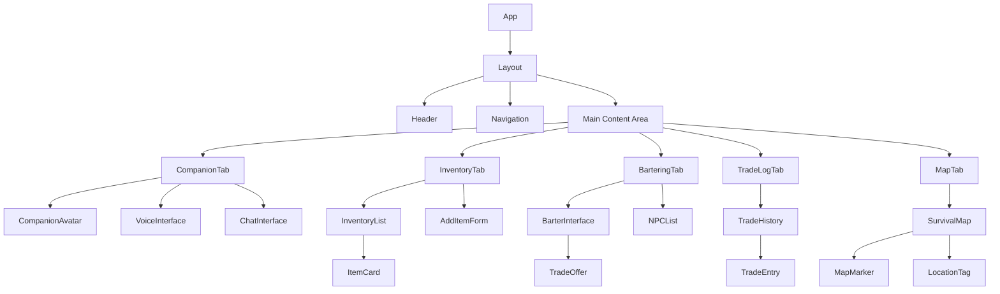
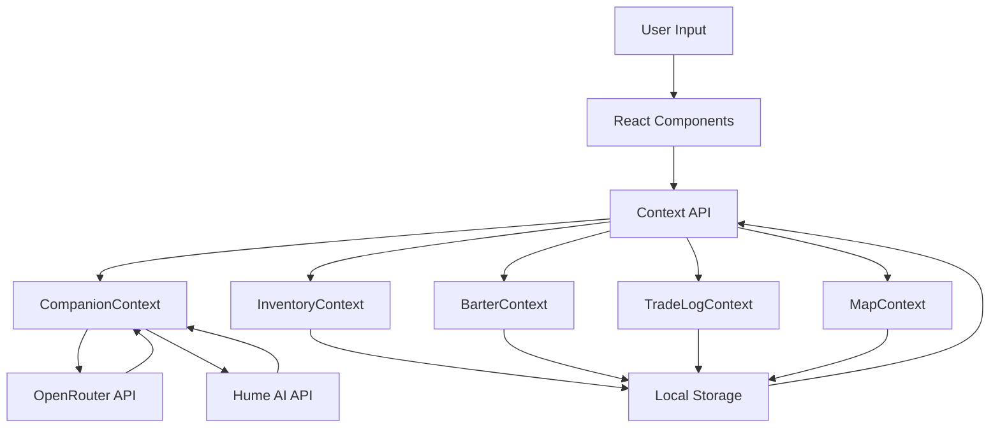

# Post-Apocalyptic AI Companion Web Application - Detailed Plan

## 1. Project Overview

### Core Features
- **AI Companion**: Interactive survival guide with text and voice interaction
- **Inventory Management**: Categorized item tracking system
- **Bartering System**: Trade interface with NPC survivors
- **Trade Log**: History of all trades made
- **Interactive Map**: Leaflet.js map with tagging functionality

### Technical Stack
- **Frontend**: React.js with Context API for state management
- **Styling**: CSS Modules for component-specific styling
- **Map**: Leaflet.js with OpenStreetMap tiles
- **AI APIs**: 
  - OpenRouter for conversation logic
  - Hume AI for voice interaction and emotional responses
- **Data Storage**: Local storage for inventory, trades, and map markers

## 2. Project Structure

```
survival-companion/
├── public/
│   ├── index.html
│   ├── favicon.ico
│   ├── manifest.json
│   └── assets/
│       ├── animations/
│       │   ├── Idle.gif
│       │   ├── Listening.gif
│       │   └── Talking.gif
│       └── icons/
│           ├── Food/
│           ├── Water/
│           ├── Medicine/
│           ├── Weapons/
│           ├── Ammo/
│           ├── Tools/
│           ├── Clothing/
│           └── Miscellaneous/
├── src/
│   ├── App.js
│   ├── index.js
│   ├── components/
│   │   ├── Layout/
│   │   │   ├── Header.js
│   │   │   ├── Navigation.js
│   │   │   ├── Header.module.css
│   │   │   └── Navigation.module.css
│   │   ├── Companion/
│   │   │   ├── CompanionAvatar.js
│   │   │   ├── VoiceInterface.js
│   │   │   ├── ChatInterface.js
│   │   │   ├── CompanionAvatar.module.css
│   │   │   ├── VoiceInterface.module.css
│   │   │   └── ChatInterface.module.css
│   │   ├── Inventory/
│   │   │   ├── InventoryList.js
│   │   │   ├── ItemCard.js
│   │   │   ├── AddItemForm.js
│   │   │   ├── InventoryList.module.css
│   │   │   ├── ItemCard.module.css
│   │   │   └── AddItemForm.module.css
│   │   ├── Bartering/
│   │   │   ├── BarterInterface.js
│   │   │   ├── TradeOffer.js
│   │   │   ├── NPCList.js
│   │   │   ├── BarterInterface.module.css
│   │   │   ├── TradeOffer.module.css
│   │   │   └── NPCList.module.css
│   │   ├── TradeLog/
│   │   │   ├── TradeHistory.js
│   │   │   ├── TradeEntry.js
│   │   │   ├── TradeHistory.module.css
│   │   │   └── TradeEntry.module.css
│   │   └── Map/
│   │       ├── SurvivalMap.js
│   │       ├── MapMarker.js
│   │       ├── LocationTag.js
│   │       ├── SurvivalMap.module.css
│   │       ├── MapMarker.module.css
│   │       └── LocationTag.module.css
│   ├── contexts/
│   │   ├── CompanionContext.js
│   │   ├── InventoryContext.js
│   │   ├── BarterContext.js
│   │   ├── TradeLogContext.js
│   │   └── MapContext.js
│   ├── services/
│   │   ├── openRouterService.js
│   │   ├── humeAIService.js
│   │   └── storageService.js
│   ├── utils/
│   │   ├── companionUtils.js
│   │   ├── inventoryUtils.js
│   │   └── mapUtils.js
│   ├── config/
│   │   ├── apiConfig.js
│   │   └── apiConfig.example.js
│   └── data/
│       ├── mockInventory.js
│       ├── mockNPCs.js
│       └── mockMapMarkers.js
├── .gitignore
├── .env
├── .env.example
└── package.json
```

## 3. Component Architecture



## 4. Data Flow Architecture



## 5. Detailed Implementation Plan

### Phase 1: Project Setup and Basic Structure

1. **Initialize React Project**
   - Create React app with minimal dependencies
   - Set up folder structure
   - Configure CSS Modules

2. **Create Basic Layout**
   - Implement Header component with post-apocalyptic styling
   - Create Navigation component for tab switching
   - Set up main content area with tab system

3. **Set Up Context API**
   - Implement CompanionContext for AI state management
   - Create InventoryContext for item management
   - Set up BarterContext for trading system
   - Implement TradeLogContext for trade history
   - Create MapContext for map interactions

4. **Configure API Keys and Environment Variables**
   - Create .env file for environment variables (git ignored)
   - Set up apiConfig.js for API configuration
   - Create apiConfig.example.js as a template (git tracked)
   - Update .gitignore to exclude sensitive files

### Phase 2: AI Companion Implementation

1. **Companion Avatar**
   - Integrate the provided GIF animations (Idle, Listening, Talking)
   - Create state management for animation switching
   - Implement responsive design for different screen sizes

2. **OpenRouter Integration**
   - Set up API service for OpenRouter
   - Implement conversation logic
   - Create prompts for survival-focused responses
   - Handle error states and fallbacks

3. **Hume AI Voice Integration**
   - Set up API service for Hume AI
   - Implement speech recognition for user input
   - Create voice synthesis for companion responses
   - Handle start/stop voice commands

4. **Chat Interface**
   - Create text-based chat UI
   - Implement message history
   - Add typing indicators and animations
   - Ensure accessibility features

### Phase 3: Inventory System

1. **Inventory Data Structure**
   - Define item categories (Food, Water, Medicine, etc.)
   - Create data models for items with properties
   - Implement local storage persistence

2. **Inventory UI Components**
   - Create color-coded ItemCard components
   - Implement InventoryList with filtering and sorting
   - Build AddItemForm with category selection
   - Add companion suggestions for inventory management

3. **Item Management**
   - Implement add/remove/update item functionality
   - Create quantity adjustment controls
   - Add validation for item properties
   - Implement companion comments on inventory changes

### Phase 4: Bartering System

1. **NPC Data Structure**
   - Create mock NPC traders with specialties
   - Define trade preferences and available items
   - Implement NPC relationship system

2. **Bartering UI**
   - Build two-column trade interface (user items vs. NPC items)
   - Create drag-and-drop functionality for item selection
   - Implement trade confirmation dialog
   - Add companion advice on trade fairness

3. **Trade Mechanics**
   - Implement trade execution logic
   - Update inventory based on completed trades
   - Create trade history entries
   - Add companion commentary on trades

### Phase 5: Trade Log

1. **Trade History Data Structure**
   - Define trade entry format with timestamps
   - Implement local storage for trade history
   - Create data models for trade records

2. **Trade Log UI**
   - Build TradeHistory component with filtering options
   - Create TradeEntry component with detailed view
   - Implement sorting and searching functionality
   - Add companion insights on trade patterns

### Phase 6: Interactive Map

1. **Leaflet.js Integration**
   - Set up Leaflet map with OpenStreetMap tiles
   - Center map on USF Tampa campus (28.0587, -82.4139)
   - Implement zoom and pan controls
   - Add attribution for OpenStreetMap

2. **Location Tagging**
   - Integrate Leaflet.draw for marker creation
   - Implement custom icons for different location types
   - Create tag naming and description system
   - Add companion comments on tagged locations

3. **Map Features**
   - Add mock resource indicators
   - Implement danger zone highlighting
   - Create location discovery system
   - Add companion suggestions for exploration

### Phase 7: Integration and Polish

1. **Cross-Component Integration**
   - Connect companion AI to all other components
   - Ensure consistent data flow between contexts
   - Implement global state updates
   - Create unified user experience

2. **UI/UX Polish**
   - Apply consistent post-apocalyptic styling
   - Implement responsive design for all screen sizes
   - Add animations and transitions
   - Ensure accessibility compliance

3. **Performance Optimization**
   - Implement lazy loading for components
   - Optimize API calls with caching
   - Minimize re-renders with memoization
   - Reduce bundle size with code splitting

4. **Testing and Debugging**
   - Conduct component testing
   - Perform end-to-end testing of key workflows
   - Fix identified bugs and issues
   - Optimize for different browsers and devices

## 6. API Integration Details

### OpenRouter API Integration

```javascript
// openRouterService.js
const API_URL = 'https://openrouter.ai/api/v1/chat/completions';
const API_KEY = process.env.REACT_APP_OPENROUTER_API_KEY;

export const sendMessage = async (message, context = []) => {
  try {
    const response = await fetch(API_URL, {
      method: 'POST',
      headers: {
        'Content-Type': 'application/json',
        'Authorization': `Bearer ${API_KEY}`
      },
      body: JSON.stringify({
        model: 'anthropic/claude-3-opus', // or another preferred model
        messages: [
          {
            role: 'system',
            content: 'You are a tough but caring post-apocalyptic survival guide with glimpses of hope. Provide practical survival advice and respond to the user as if you are their loyal companion in a harsh, desolate world.'
          },
          ...context,
          {
            role: 'user',
            content: message
          }
        ]
      })
    });
    
    const data = await response.json();
    return data.choices[0].message.content;
  } catch (error) {
    console.error('Error communicating with OpenRouter:', error);
    return 'I\'m having trouble connecting to my knowledge base. Let\'s try again when the signal is better.';
  }
};
```

### Hume AI Integration

```javascript
// humeAIService.js
const API_URL = 'https://api.hume.ai/v0';
const API_KEY = process.env.REACT_APP_HUME_AI_KEY;

// Speech recognition
export const startListening = async (onResult, onError) => {
  try {
    // Initialize Hume AI speech recognition
    const recognition = new (window.SpeechRecognition || window.webkitSpeechRecognition)();
    recognition.continuous = true;
    recognition.interimResults = false;
    
    recognition.onresult = (event) => {
      const transcript = event.results[event.results.length - 1][0].transcript;
      onResult(transcript);
    };
    
    recognition.onerror = (event) => {
      onError(event.error);
    };
    
    recognition.start();
    return recognition;
  } catch (error) {
    console.error('Error starting speech recognition:', error);
    onError('Failed to start listening');
    return null;
  }
};

// Voice synthesis
export const speakText = async (text) => {
  try {
    const response = await fetch(`${API_URL}/speech/synthesize`, {
      method: 'POST',
      headers: {
        'Content-Type': 'application/json',
        'Authorization': `Bearer ${API_KEY}`
      },
      body: JSON.stringify({
        text,
        voice_id: 'en_male_1', // or another appropriate voice
        prosody: {
          rate: 1.0,
          pitch: 1.0,
          volume: 1.0
        }
      })
    });
    
    const data = await response.json();
    const audioUrl = data.audio_url;
    
    // Play the synthesized speech
    const audio = new Audio(audioUrl);
    return audio.play();
  } catch (error) {
    console.error('Error synthesizing speech:', error);
    // Fallback to browser's speech synthesis
    const utterance = new SpeechSynthesisUtterance(text);
    return window.speechSynthesis.speak(utterance);
  }
};
```

## 7. Configuration Management

### API Configuration

```javascript
// src/config/apiConfig.example.js
// This is a template file that should be copied to apiConfig.js with real API keys
// apiConfig.js should be git ignored to prevent exposing sensitive information

const apiConfig = {
  openRouter: {
    apiKey: 'YOUR_OPENROUTER_API_KEY',
    baseUrl: 'https://openrouter.ai/api/v1',
    defaultModel: 'anthropic/claude-3-opus'
  },
  humeAI: {
    apiKey: 'YOUR_HUME_AI_API_KEY',
    baseUrl: 'https://api.hume.ai/v0',
    defaultVoice: 'en_male_1'
  },
  openStreetMap: {
    tileUrl: 'https://{s}.tile.openstreetmap.org/{z}/{x}/{y}.png',
    attribution: '&copy; <a href="https://www.openstreetmap.org/copyright">OpenStreetMap</a> contributors',
    maxZoom: 19
  }
};

export default apiConfig;
```

### Environment Variables

```
# .env.example
# Copy this file to .env and fill in your actual API keys
# .env should be git ignored to prevent exposing sensitive information

REACT_APP_OPENROUTER_API_KEY=your_openrouter_api_key_here
REACT_APP_HUME_AI_KEY=your_hume_ai_key_here
```

### Git Ignore Configuration

```
# .gitignore

# dependencies
/node_modules
/.pnp
.pnp.js

# testing
/coverage

# production
/build

# misc
.DS_Store
.env
.env.local
.env.development.local
.env.test.local
.env.production.local

# API configuration with real keys
/src/config/apiConfig.js

npm-debug.log*
yarn-debug.log*
yarn-error.log*
```

## 8. Map Implementation

```javascript
// SurvivalMap.js
import React, { useEffect, useRef, useContext } from 'react';
import L from 'leaflet';
import 'leaflet/dist/leaflet.css';
import 'leaflet-draw/dist/leaflet.draw.css';
import { MapContext } from '../../contexts/MapContext';
import { CompanionContext } from '../../contexts/CompanionContext';
import apiConfig from '../../config/apiConfig';
import styles from './SurvivalMap.module.css';

const SurvivalMap = () => {
  const mapRef = useRef(null);
  const leafletMap = useRef(null);
  const { markers, addMarker, removeMarker } = useContext(MapContext);
  const { triggerCompanionResponse } = useContext(CompanionContext);
  
  useEffect(() => {
    // Initialize map
    if (!leafletMap.current) {
      leafletMap.current = L.map(mapRef.current).setView([28.0587, -82.4139], 15);
      
      // Add OpenStreetMap tiles with post-apocalyptic style
      L.tileLayer(apiConfig.openStreetMap.tileUrl, {
        attribution: apiConfig.openStreetMap.attribution,
        maxZoom: apiConfig.openStreetMap.maxZoom,
        className: styles.mapTiles // Apply CSS filter for post-apocalyptic look
      }).addTo(leafletMap.current);
      
      // Initialize draw controls
      const drawnItems = new L.FeatureGroup();
      leafletMap.current.addLayer(drawnItems);
      
      const drawControl = new L.Control.Draw({
        draw: {
          polyline: false,
          circle: false,
          circlemarker: false,
          polygon: {
            allowIntersection: false,
            drawError: {
              color: '#e1e100',
              message: '<strong>Warning:</strong> shape edges cannot cross!'
            },
            shapeOptions: {
              color: '#ff7800'
            }
          },
          rectangle: {
            shapeOptions: {
              color: '#ff7800'
            }
          },
          marker: {
            icon: new L.Icon({
              iconUrl: '/assets/icons/marker-icon.png',
              iconSize: [25, 41],
              iconAnchor: [12, 41]
            })
          }
        },
        edit: {
          featureGroup: drawnItems
        }
      });
      
      leafletMap.current.addControl(drawControl);
      
      // Handle draw events
      leafletMap.current.on(L.Draw.Event.CREATED, (event) => {
        const layer = event.layer;
        drawnItems.addLayer(layer);
        
        // Prompt for location name and description
        const locationName = prompt('Name this location:');
        if (locationName) {
          const locationDesc = prompt('Add a description (optional):');
          const newMarker = {
            id: Date.now().toString(),
            name: locationName,
            description: locationDesc || '',
            type: event.layerType,
            coordinates: event.layerType === 'marker' 
              ? [layer.getLatLng().lat, layer.getLatLng().lng]
              : layer.getLatLngs()
          };
          
          addMarker(newMarker);
          
          // Trigger companion response about the new marker
          triggerCompanionResponse(`map_marker_added:${locationName}`);
          
          // Add popup to the layer
          layer.bindPopup(`<strong>${locationName}</strong><br>${locationDesc || ''}`);
        } else {
          drawnItems.removeLayer(layer);
        }
      });
      
      // Handle delete events
      leafletMap.current.on(L.Draw.Event.DELETED, (event) => {
        const layers = event.layers;
        layers.eachLayer((layer) => {
          // Find and remove the corresponding marker from state
          const markerId = Object.keys(drawnItems._layers).find(
            id => drawnItems._layers[id] === layer
          );
          if (markerId) {
            removeMarker(markerId);
          }
        });
      });
    }
    
    // Add existing markers to map
    return () => {
      if (leafletMap.current) {
        leafletMap.current.remove();
        leafletMap.current = null;
      }
    };
  }, [addMarker, removeMarker, triggerCompanionResponse]);
  
  // Update markers when they change in context
  useEffect(() => {
    if (leafletMap.current) {
      // Clear existing markers
      leafletMap.current.eachLayer((layer) => {
        if (layer instanceof L.Marker || layer instanceof L.Polygon) {
          leafletMap.current.removeLayer(layer);
        }
      });
      
      // Add markers from context
      markers.forEach((marker) => {
        if (marker.type === 'marker') {
          const newMarker = L.marker(marker.coordinates).addTo(leafletMap.current);
          newMarker.bindPopup(`<strong>${marker.name}</strong><br>${marker.description || ''}`);
        } else if (marker.type === 'polygon' || marker.type === 'rectangle') {
          const newPolygon = L.polygon(marker.coordinates, {
            color: '#ff7800'
          }).addTo(leafletMap.current);
          newPolygon.bindPopup(`<strong>${marker.name}</strong><br>${marker.description || ''}`);
        }
      });
    }
  }, [markers]);
  
  return <div ref={mapRef} className={styles.mapContainer}></div>;
};

export default SurvivalMap;
```

## 9. Inventory Implementation

```javascript
// InventoryContext.js
import React, { createContext, useState, useEffect, useContext } from 'react';
import { CompanionContext } from './CompanionContext';

export const InventoryContext = createContext();

const CATEGORIES = [
  'Food', 'Water', 'Medicine', 'Weapons', 'Ammo', 'Tools', 'Clothing', 'Miscellaneous'
];

export const InventoryProvider = ({ children }) => {
  const [inventory, setInventory] = useState([]);
  const { triggerCompanionResponse } = useContext(CompanionContext);
  
  // Load inventory from localStorage on mount
  useEffect(() => {
    const savedInventory = localStorage.getItem('survival-inventory');
    if (savedInventory) {
      setInventory(JSON.parse(savedInventory));
    }
  }, []);
  
  // Save inventory to localStorage when it changes
  useEffect(() => {
    localStorage.setItem('survival-inventory', JSON.stringify(inventory));
  }, [inventory]);
  
  // Add a new item to inventory
  const addItem = (item) => {
    // Check if item already exists
    const existingItemIndex = inventory.findIndex(
      i => i.name.toLowerCase() === item.name.toLowerCase() && i.category === item.category
    );
    
    if (existingItemIndex >= 0) {
      // Update quantity of existing item
      const updatedInventory = [...inventory];
      updatedInventory[existingItemIndex] = {
        ...updatedInventory[existingItemIndex],
        quantity: updatedInventory[existingItemIndex].quantity + (item.quantity || 1)
      };
      setInventory(updatedInventory);
      triggerCompanionResponse(`inventory_updated:${item.name}`);
    } else {
      // Add new item
      const newItem = {
        id: Date.now().toString(),
        name: item.name,
        category: item.category,
        quantity: item.quantity || 1,
        description: item.description || '',
        icon: item.icon || `${item.category.toLowerCase()}.png`
      };
      setInventory([...inventory, newItem]);
      triggerCompanionResponse(`inventory_added:${item.name}`);
    }
  };
  
  // Remove an item from inventory
  const removeItem = (itemId) => {
    const itemToRemove = inventory.find(item => item.id === itemId);
    setInventory(inventory.filter(item => item.id !== itemId));
    if (itemToRemove) {
      triggerCompanionResponse(`inventory_removed:${itemToRemove.name}`);
    }
  };
  
  // Update an item's quantity
  const updateItemQuantity = (itemId, newQuantity) => {
    if (newQuantity <= 0) {
      removeItem(itemId);
      return;
    }
    
    const updatedInventory = inventory.map(item => 
      item.id === itemId ? { ...item, quantity: newQuantity } : item
    );
    setInventory(updatedInventory);
  };
  
  // Get items by category
  const getItemsByCategory = (category) => {
    return inventory.filter(item => item.category === category);
  };
  
  // Get all categories
  const getCategories = () => CATEGORIES;
  
  return (
    <InventoryContext.Provider value={{
      inventory,
      addItem,
      removeItem,
      updateItemQuantity,
      getItemsByCategory,
      getCategories
    }}>
      {children}
    </InventoryContext.Provider>
  );
};
```

## 10. Companion Integration

```javascript
// CompanionContext.js
import React, { createContext, useState, useEffect, useCallback } from 'react';
import { sendMessage } from '../services/openRouterService';
import { startListening, speakText } from '../services/humeAIService';
import apiConfig from '../config/apiConfig';

export const CompanionContext = createContext();

export const CompanionProvider = ({ children }) => {
  const [state, setState] = useState('idle'); // idle, listening, talking
  const [messages, setMessages] = useState([]);
  const [context, setContext] = useState([]);
  const [recognition, setRecognition] = useState(null);
  
  // Handle companion state changes
  useEffect(() => {
    // Update avatar animation based on state
    const companionAvatar = document.getElementById('companion-avatar');
    if (companionAvatar) {
      companionAvatar.src = `/assets/animations/${state.charAt(0).toUpperCase() + state.slice(1)}.gif`;
    }
  }, [state]);
  
  // Start listening for voice input
  const startVoiceInput = useCallback(() => {
    setState('listening');
    
    const handleResult = async (transcript) => {
      // Check for stop command
      if (transcript.toLowerCase().includes('stop') || 
          transcript.toLowerCase().includes('end')) {
        stopVoiceInput();
        return;
      }
      
      // Add user message
      const userMessage = {
        role: 'user',
        content: transcript,
        timestamp: new Date().toISOString()
      };
      
      setMessages(prev => [...prev, userMessage]);
      setContext(prev => [...prev, { role: 'user', content: transcript }]);
      
      // Get companion response
      setState('talking');
      const response = await sendMessage(transcript, context);
      
      // Add companion message
      const companionMessage = {
        role: 'assistant',
        content: response,
        timestamp: new Date().toISOString()
      };
      
      setMessages(prev => [...prev, companionMessage]);
      setContext(prev => [...prev, { role: 'assistant', content: response }]);
      
      // Speak the response
      await speakText(response);
      setState('idle');
    };
    
    const handleError = (error) => {
      console.error('Speech recognition error:', error);
      setState('idle');
    };
    
    const recognitionInstance = startListening(handleResult, handleError);
    setRecognition(recognitionInstance);
  }, [context]);
  
  // Stop listening for voice input
  const stopVoiceInput = useCallback(() => {
    if (recognition) {
      recognition.stop();
      setRecognition(null);
    }
    setState('idle');
  }, [recognition]);
  
  // Send a text message to the companion
  const sendTextMessage = useCallback(async (message) => {
    // Add user message
    const userMessage = {
      role: 'user',
      content: message,
      timestamp: new Date().toISOString()
    };
    
    setMessages(prev => [...prev, userMessage]);
    setContext(prev => [...prev, { role: 'user', content: message }]);
    
    // Get companion response
    setState('talking');
    const response = await sendMessage(message, context);
    
    // Add companion message
    const companionMessage = {
      role: 'assistant',
      content: response,
      timestamp: new Date().toISOString()
    };
    
    setMessages(prev => [...prev, companionMessage]);
    setContext(prev => [...prev, { role: 'assistant', content: response }]);
    
    // Speak the response
    await speakText(response);
    setState('idle');
    
    return response;
  }, [context]);
  
  // Trigger a companion response based on an event
  const triggerCompanionResponse = useCallback(async (event) => {
    // Parse the event
    const [eventType, eventData] = event.split(':');
    
    // Generate appropriate message based on event type
    let message = '';
    switch (eventType) {
      case 'inventory_added':
        message = `I've added ${eventData} to my inventory.`;
        break;
      case 'inventory_removed':
        message = `I've removed ${eventData} from my inventory.`;
        break;
      case 'inventory_updated':
        message = `I've updated the quantity of ${eventData} in my inventory.`;
        break;
      case 'trade_completed':
        message = `I've completed a trade for ${eventData}.`;
        break;
      case 'map_marker_added':
        message = `I've marked ${eventData} on my map.`;
        break;
      default:
        return; // Don't respond to unknown events
    }
    
    // Get companion response
    setState('talking');
    const response = await sendMessage(message, [
      ...context,
      { role: 'system', content: `The user has just: ${event}. Provide a brief, relevant comment about this action.` }
    ]);
    
