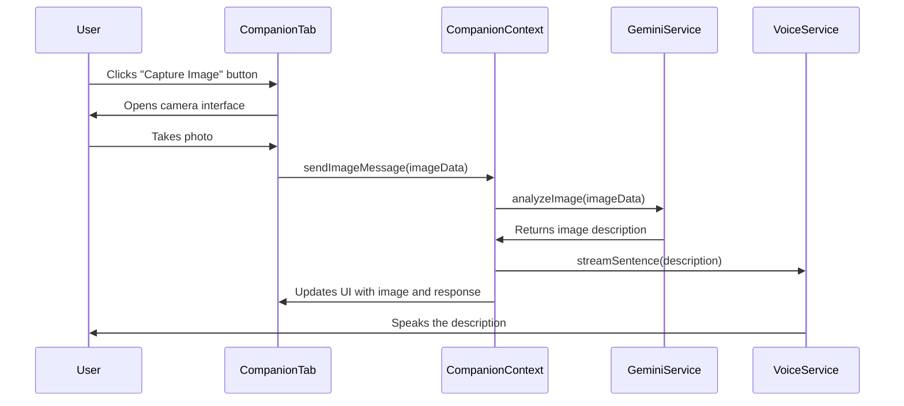

# Image Understanding Feature Implementation Plan

## Overview

We'll add a new feature to the CompanionTab component that allows users to:
1. Capture an image from their camera
2. Send the image to Gemini 2.0 Flash for analysis
3. Receive a textual description of the image
4. Convert that description to speech using ElevenLabs
5. Display both the image and the text response in the conversation

## Architecture Diagram



## Implementation Steps

### 1. Update GeminiService to Support Image Analysis

We need to extend the GeminiService to handle image data and send it to the Gemini 2.0 Flash API.

```typescript
// Add to GeminiService.ts
public async analyzeImage(
  imageData: string, // Base64 encoded image data
  onChunk: (text: string) => void,
  onSentence?: (sentence: string) => void
): Promise<string> {
  try {
    // Create a prompt that instructs Gemini how to analyze the image
    const prompt = `
      Analyze this image from a post-apocalyptic survival perspective. 
      Describe what you see and provide any relevant survival insights.
      
      IMPORTANT: Always speak in first person. Never refer to yourself by name or in the third person.
      
      Format your response to convey your personality and emotions through voice synthesis:
      1. Use ellipses (...) for hesitation: "I'm... calculating your chances of survival."
      2. Use dashes (—) for interruptions: "That plan might work—if you enjoy explosions."
      3. Use short, punchy sentences for emphasis: "Brilliant plan. Truly inspired. Almost as good as walking into the mutant nest."
      4. Use dry, deadpan delivery: "I calculate your survival chances at 32%. Not great. Not terrible. Just... underwhelming."
      
      Do not use special characters like asterisks or underscores as they will be spoken literally.
    `;

    // Create a parts array with the text prompt and image data
    const parts = [
      { text: prompt },
      { inlineData: { mimeType: "image/jpeg", data: imageData.split(',')[1] } }
    ];

    // Use the Gemini API to analyze the image
    const model = this.genAI.getGenerativeModel({ model: apiConfig.gemini.model });
    const result = await model.generateContentStream({
      contents: [{ role: "user", parts }],
      generationConfig: {
        temperature: apiConfig.gemini.temperature,
        maxOutputTokens: apiConfig.gemini.maxOutputTokens,
        topK: apiConfig.gemini.topK,
        topP: apiConfig.gemini.topP,
      }
    });

    // Process the streaming response
    let fullResponse = '';
    let currentSentence = '';
    const sentenceEndRegex = /[.!?]\s*$/;
    
    for await (const chunk of result.stream) {
      const chunkText = chunk.text();
      fullResponse += chunkText;
      onChunk(chunkText);
      
      // Process sentences if the callback is provided
      if (onSentence) {
        currentSentence += chunkText;
        
        // Check if we have a complete sentence
        if (sentenceEndRegex.test(currentSentence)) {
          onSentence(currentSentence.trim());
          currentSentence = '';
        }
      }
    }
    
    // Handle any remaining text as a sentence
    if (onSentence && currentSentence.trim().length > 0) {
      onSentence(currentSentence.trim());
    }
    
    return fullResponse;
  } catch (error) {
    console.error('Error analyzing image:', error);
    const errorMessage = 'I apologize, but I encountered an error while analyzing the image.';
    onChunk(errorMessage);
    if (onSentence) {
      onSentence(errorMessage);
    }
    return errorMessage;
  }
}
```

### 2. Update CompanionContext to Support Image Messages

We need to extend the Message interface and add methods to handle image messages.

```typescript
// Update Message interface in CompanionContext.tsx
export interface Message {
  role: 'user' | 'assistant';
  content: string;
  timestamp: string;
  isStreaming?: boolean;
  imageData?: string; // Base64 encoded image data
}

// Add to CompanionContextType
interface CompanionContextType {
  // ... existing properties
  sendImageMessage: (imageData: string) => void;
}

// Add to CompanionProvider
const sendImageMessage = useCallback(async (imageData: string) => {
  // Add user message with image
  const userMessage: Message = {
    role: 'user',
    content: 'Image captured',
    timestamp: new Date().toISOString(),
    imageData: imageData
  };
  
  setMessages(prev => [...prev, userMessage]);
  setState('thinking');
  
  try {
    // Create a placeholder for the assistant's response
    const assistantMessage: Message = {
      role: 'assistant',
      content: '',
      timestamp: new Date().toISOString(),
      isStreaming: true
    };
    
    // Add the placeholder message
    setMessages(prev => [...prev, assistantMessage]);
    streamingMessageRef.current = assistantMessage;
    
    setState('responding');
    
    // Stop any previous speech
    if (isVoiceEnabled) {
      voiceService.stopSpeaking();
    }
    
    // Generate streaming response with sentence-level processing for voice
    await geminiService.analyzeImage(
      imageData,
      // Handle each text chunk for display
      (chunkText) => {
        // Update the streaming message with each chunk
        setMessages(prev => {
          const updatedMessages = [...prev];
          const lastIndex = updatedMessages.length - 1;
          
          if (lastIndex >= 0 && updatedMessages[lastIndex].isStreaming) {
            updatedMessages[lastIndex] = {
              ...updatedMessages[lastIndex],
              content: updatedMessages[lastIndex].content + chunkText
            };
          }
          
          return updatedMessages;
        });
      },
      // Handle each complete sentence for voice with WebSocket-based streaming
      isVoiceEnabled ? (sentence) => {
        // Generate a unique conversation ID based on timestamp
        const conversationId = `conv_${Date.now()}_image`;
        
        // Use the optimized WebSocket-based streaming for real-time speech
        if (sentence.trim().length > 0) {
          console.log('Streaming image analysis sentence with conversation ID:', conversationId);
          // Process the sentence for optimal TARS voice delivery
          const processedSentence = processTARSResponse(sentence);
          voiceService.streamSentence(processedSentence, conversationId);
        }
      } : undefined
    );
    
    // Mark the message as no longer streaming
    setMessages(prev => {
      const updatedMessages = [...prev];
      const lastIndex = updatedMessages.length - 1;
      
      if (lastIndex >= 0 && updatedMessages[lastIndex].isStreaming) {
        updatedMessages[lastIndex] = {
          ...updatedMessages[lastIndex],
          isStreaming: false
        };
      }
      
      return updatedMessages;
    });
    
    streamingMessageRef.current = null;
    
    setState('idle');
  } catch (error) {
    console.error('Error processing image:', error);
    
    // Add error message
    const errorMessage: Message = {
      role: 'assistant',
      content: 'I apologize, but I encountered an error while analyzing the image.',
      timestamp: new Date().toISOString()
    };
    
    setMessages(prev => {
      // Remove the streaming message if it exists
      const filteredMessages = prev.filter(msg => !msg.isStreaming);
      return [...filteredMessages, errorMessage];
    });
    
    streamingMessageRef.current = null;
    setState('idle');
  }
}, [isVoiceEnabled]);

// Add to CompanionContext.Provider value
<CompanionContext.Provider value={{
  // ... existing properties
  sendImageMessage
}}>
```

### 3. Create a Camera Component

Create a new component to handle camera capture functionality.

```typescript
// Create a new file: src/components/Companion/CameraCapture.tsx
import React, { useRef, useState, useEffect } from 'react';

interface CameraCaptureProps {
  onCapture: (imageData: string) => void;
  onCancel: () => void;
}

const CameraCapture: React.FC<CameraCaptureProps> = ({ onCapture, onCancel }) => {
  const videoRef = useRef<HTMLVideoElement>(null);
  const canvasRef = useRef<HTMLCanvasElement>(null);
  const [isStreaming, setIsStreaming] = useState(false);
  const [error, setError] = useState<string | null>(null);

  useEffect(() => {
    // Start the camera when the component mounts
    const startCamera = async () => {
      try {
        const stream = await navigator.mediaDevices.getUserMedia({ 
          video: { facingMode: 'environment' } // Use the back camera if available
        });
        
        if (videoRef.current) {
          videoRef.current.srcObject = stream;
          setIsStreaming(true);
        }
      } catch (err) {
        console.error('Error accessing camera:', err);
        setError('Could not access camera. Please check permissions and try again.');
      }
    };

    startCamera();

    // Clean up function to stop the camera when component unmounts
    return () => {
      if (videoRef.current && videoRef.current.srcObject) {
        const stream = videoRef.current.srcObject as MediaStream;
        const tracks = stream.getTracks();
        tracks.forEach(track => track.stop());
      }
    };
  }, []);

  const captureImage = () => {
    if (videoRef.current && canvasRef.current && isStreaming) {
      const video = videoRef.current;
      const canvas = canvasRef.current;
      
      // Set canvas dimensions to match video
      canvas.width = video.videoWidth;
      canvas.height = video.videoHeight;
      
      // Draw the current video frame to the canvas
      const context = canvas.getContext('2d');
      if (context) {
        context.drawImage(video, 0, 0, canvas.width, canvas.height);
        
        // Convert canvas to base64 image data
        const imageData = canvas.toDataURL('image/jpeg');
        onCapture(imageData);
        
        // Stop the camera stream
        if (video.srcObject) {
          const stream = video.srcObject as MediaStream;
          const tracks = stream.getTracks();
          tracks.forEach(track => track.stop());
        }
      }
    }
  };

  return (
    <div className="camera-capture">
      {error && (
        <div className="alert alert-danger" style={{
          backgroundColor: 'var(--danger-color)',
          color: 'var(--text-color)',
          padding: '0.5rem 1rem',
          borderRadius: '4px',
          marginBottom: '1rem'
        }}>
          {error}
        </div>
      )}
      
      <video 
        ref={videoRef} 
        autoPlay 
        playsInline 
        style={{ width: '100%', borderRadius: '4px' }}
      />
      
      <canvas ref={canvasRef} style={{ display: 'none' }} />
      
      <div className="camera-controls" style={{ 
        display: 'flex', 
        justifyContent: 'space-between',
        marginTop: '1rem' 
      }}>
        <button 
          className="button" 
          onClick={onCancel}
          style={{
            backgroundColor: 'var(--danger-color)',
            border: 'none',
            padding: '0.5rem 1rem',
            borderRadius: '4px',
            cursor: 'pointer'
          }}
        >
          Cancel
        </button>
        
        <button 
          className="button" 
          onClick={captureImage}
          style={{
            backgroundColor: 'var(--accent-color)',
            border: 'none',
            padding: '0.5rem 1rem',
            borderRadius: '4px',
            cursor: 'pointer'
          }}
          disabled={!isStreaming}
        >
          Capture
        </button>
      </div>
    </div>
  );
};

export default CameraCapture;
```

### 4. Update MessageList Component to Display Images

Modify the MessageList component to display images in the conversation.

```typescript
// Update src/components/Companion/MessageList.tsx
// Add to the message rendering logic

// Inside the message rendering function
{message.imageData && (
  <div className="message-image" style={{ marginBottom: '0.5rem' }}>
    
  </div>
)}
```

### 5. Update TextInput Component to Add Camera Button

Modify the TextInput component to include a camera button.

```typescript
// Update src/components/Companion/TextInput.tsx
import React, { useState, useContext } from 'react';
import { CompanionContext } from '../../contexts/CompanionContext';
import CameraCapture from './CameraCapture';

const TextInput: React.FC = () => {
  const { sendMessage, sendImageMessage } = useContext(CompanionContext);
  const [message, setMessage] = useState('');
  const [showCamera, setShowCamera] = useState(false);

  const handleSubmit = (e: React.FormEvent) => {
    e.preventDefault();
    if (message.trim()) {
      sendMessage(message);
      setMessage('');
    }
  };

  const handleCameraCapture = (imageData: string) => {
    sendImageMessage(imageData);
    setShowCamera(false);
  };

  return (
    <>
      {showCamera ? (
        <CameraCapture 
          onCapture={handleCameraCapture} 
          onCancel={() => setShowCamera(false)} 
        />
      ) : (
        <form onSubmit={handleSubmit} className="text-input-form">
          <div className="input-group" style={{ 
            display: 'flex',
            alignItems: 'center',
            gap: '0.5rem'
          }}>
            <button
              type="button"
              onClick={() => setShowCamera(true)}
              style={{
                backgroundColor: 'var(--primary-color)',
                border: '1px solid var(--border-color)',
                borderRadius: '4px',
                padding: '0.5rem',
                cursor: 'pointer',
                display: 'flex',
                alignItems: 'center',
                justifyContent: 'center'
              }}
              title="Capture Image"
            >
              <svg 
                xmlns="http://www.w3.org/2000/svg" 
                width="20" 
                height="20" 
                viewBox="0 0 24 24" 
                fill="none" 
                stroke="currentColor" 
                strokeWidth="2" 
                strokeLinecap="round" 
                strokeLinejoin="round"
              >
                <path d="M23 19a2 2 0 0 1-2 2H3a2 2 0 0 1-2-2V8a2 2 0 0 1 2-2h4l2-3h6l2 3h4a2 2 0 0 1 2 2z"></path>
                <circle cx="12" cy="13" r="4"></circle>
              </svg>
            </button>
            
            <input
              type="text"
              value={message}
              onChange={(e) => setMessage(e.target.value)}
              placeholder="Type a message..."
              style={{
                flex: 1,
                padding: '0.5rem',
                borderRadius: '4px',
                border: '1px solid var(--border-color)',
                backgroundColor: 'var(--primary-color)',
                color: 'var(--text-color)'
              }}
            />
            
            <button
              type="submit"
              disabled={!message.trim()}
              style={{
                backgroundColor: message.trim() ? 'var(--accent-color)' : 'var(--primary-color)',
                border: message.trim() ? 'none' : '1px solid var(--border-color)',
                borderRadius: '4px',
                padding: '0.5rem 1rem',
                cursor: message.trim() ? 'pointer' : 'not-allowed',
                color: 'var(--text-color)'
              }}
            >
              Send
            </button>
          </div>
        </form>
      )}
    </>
  );
};

export default TextInput;
```

## Technical Considerations

### 1. Image Format and Size

- We'll use JPEG format for images to ensure compatibility with Gemini 2.0 Flash
- Images will be encoded as base64 strings for transmission
- We may need to resize large images to reduce bandwidth usage and processing time

### 2. API Limitations

- Gemini 2.0 Flash has a maximum input size limit, so we may need to compress images
- ElevenLabs has rate limits and token usage limits that we need to consider

### 3. Error Handling

- We need robust error handling for camera access issues
- We should handle API errors gracefully and provide feedback to the user
- We should consider fallback options if image analysis fails

### 4. Privacy Considerations

- Images are processed in the browser and sent directly to Google's Gemini API
- We should inform users about data usage and privacy implications
- We should consider adding an option to delete images after analysis

## Testing Plan

1. **Unit Tests**
   - Test the GeminiService.analyzeImage method with mock image data
   - Test the CompanionContext.sendImageMessage method
   - Test the CameraCapture component with mock media streams

2. **Integration Tests**
   - Test the end-to-end flow from image capture to response display
   - Test error handling scenarios
   - Test with different image types and sizes

3. **Manual Testing**
   - Test on different devices and browsers
   - Test with real-world images in various lighting conditions
   - Test voice output quality and timing

## Implementation Timeline

1. **Day 1**: Set up the GeminiService.analyzeImage method and test with sample images
2. **Day 2**: Implement the CameraCapture component and integrate with CompanionTab
3. **Day 3**: Update the CompanionContext to handle image messages
4. **Day 4**: Update the MessageList component to display images
5. **Day 5**: Test and refine the implementation