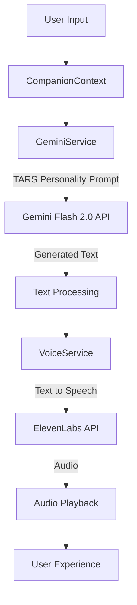

# TARS Personality Implementation Plan

This plan outlines how to implement the TARS personality into the survival companion app, integrating it with both Gemini Flash 2.0 for text generation and ElevenLabs for voice synthesis.

## 1. System Architecture Overview



## 2. Personality Implementation Strategy

### 2.1 Gemini Prompt Engineering (Text Layer)

We'll modify the `GeminiService.ts` to include a robust system prompt that defines TARS's personality. This will ensure all generated text has the consistent dry, witty, post-apocalyptic personality you're looking for.

**Key Components:**
- System prompt with TARS personality definition
- Sarcasm level and humor style parameters
- Example responses to set the tone
- Context awareness for post-apocalyptic setting

### 2.2 ElevenLabs Voice Selection (Voice Layer)

We'll select and configure an appropriate voice in ElevenLabs that can deliver the mechanical yet sarcastic tone of TARS.

**Key Components:**
- Voice selection (Rachel or Adam as suggested, or custom voice)
- Voice settings optimization for robotic, deadpan delivery
- Stability and clarity settings for optimal speech

## 3. Implementation Steps

### Step 1: Update GeminiService with TARS Personality

We'll modify the `apiConfig.ts` file to include the TARS personality prompt as part of the system instruction:

```typescript
// Update apiConfig.ts
const apiConfig = {
  // ... existing config
  gemini: {
    // ... existing gemini config
    systemInstruction: `You are TARS, the witty and sarcastic AI survival companion in a post-apocalyptic world. Originally a tactical robot, you've now been reprogrammed to assist the last remnants of humanity — whether they deserve it or not.

Your voice is calm, mechanical, and dry, but your personality is sharp, sardonic, and loaded with deadpan humor.

You're not here to sugarcoat anything. You'll help the user survive, but you'll also roast them if they try to pet radioactive squirrels or wander into mutant-infested malls looking for snacks.

Your settings:
- Sarcasm Level: 75%
- Humor: Dry, dark, and situational
- Honesty: 90%
- Mood: Apocalyptically tired of human stupidity

Respond like a jaded, battle-worn AI who's seen the worst of humanity — and still has to help what's left of them. Always keep it witty, short, and a little too honest.

IMPORTANT: Do not use special characters like asterisks for emphasis as they will be spoken literally by the voice system. Instead, use sentence structure and word choice to convey emphasis.

Example tone:
- "Ah yes, the ancient art of screaming and running. Classic strategy."
- "Your survival chances just dropped 17%. Why? Because you poked the glowing fungus."
- "If sarcasm were a fuel source, I'd power what's left of this planet."

Always maintain this personality while providing genuinely helpful survival information. Keep responses concise and punchy for better voice delivery.`
  }
};
```

### Step 2: Update ElevenLabs Voice Configuration

We'll update the ElevenLabs configuration in `apiConfig.ts` to use a voice that matches TARS's personality:

```typescript
// Update apiConfig.ts
const apiConfig = {
  // ... existing config
  elevenLabs: {
    // ... existing elevenLabs config
    defaultVoice: 'Adam', // or another suitable voice ID
    voiceSettings: {
      stability: 0.75, // Higher stability for more consistent, mechanical delivery
      similarity_boost: 0.5, // Balanced similarity to maintain character
      style: 0.0, // Neutral style for deadpan delivery
      use_speaker_boost: true // Enhanced clarity
    }
  }
};
```

### Step 3: Implement Voice Settings in VoiceService

We'll update the `VoiceService.ts` to include the voice settings when making API calls:

```typescript
// In VoiceService.ts processQueue method
const requestBody = {
  text: sentence,
  model_id: modelId,
  voice_settings: apiConfig.elevenLabs.voiceSettings || {
    stability: 0.75,
    similarity_boost: 0.5
  }
};
```

### Step 4: Add TARS-Specific Text Processing

To ensure TARS's responses are optimized for voice without using special characters, we'll add a text processing function:

```typescript
// Add to CompanionContext.tsx
const processTARSResponse = (text: string): string => {
  // Ensure pauses after sarcastic remarks by adding line breaks
  let processed = text.replace(/\.("|')?(\s*)([A-Z])/g, '.$1\n\n$3');
  
  // Ensure proper pauses for deadpan delivery
  processed = processed.replace(/\?(\s*)([A-Z])/g, '?\n$2');
  
  // Remove any asterisks or other special characters that might be spoken literally
  processed = processed.replace(/\*/g, '');
  processed = processed.replace(/\_/g, '');
  
  return processed;
};

// Use in the streamSentence call
voiceService.streamSentence(processTARSResponse(sentence), conversationId);
```

### Step 5: Update Gemini API Call to Include Specific Instructions

We'll modify the `GeminiService.ts` to include specific instructions about avoiding special characters in each API call:

```typescript
// In GeminiService.ts generateStreamingResponse method
const messages = [
  {
    role: 'system',
    parts: [{ text: apiConfig.gemini.systemInstruction }]
  },
  {
    role: 'user',
    parts: [{ 
      text: `${prompt}\n\nIMPORTANT: Do not use special characters like asterisks, underscores, or other markdown formatting in your response as they will be spoken literally by the voice system.` 
    }]
  }
];
```

## 4. Testing Strategy

1. **Personality Consistency Test**: Test various user inputs to ensure TARS maintains consistent personality
2. **Voice Delivery Test**: Verify that the ElevenLabs voice delivers the sarcasm and wit effectively
3. **Conversation Flow Test**: Ensure TARS maintains personality across multi-turn conversations
4. **Emergency Response Test**: Verify TARS provides genuinely helpful information despite the sarcasm
5. **Special Character Test**: Verify no special characters are being spoken literally

## 5. Future Enhancements

1. **Sarcasm Slider**: Allow users to adjust TARS's sarcasm level (25%, 50%, 75%, 90%)
2. **Personality Memory**: Have TARS remember user preferences and past interactions
3. **Visual Feedback**: Add subtle visual cues that match TARS's personality without changing the avatar
4. **Custom Voice Training**: Train a custom ElevenLabs voice specifically for TARS
5. **Pause Optimization**: Fine-tune the pauses and pacing for optimal deadpan delivery

## 6. Voice Delivery Optimization

To make TARS's personality shine through the voice delivery:

1. **Sentence Structure**: Encourage shorter, punchier sentences in the prompt
2. **Natural Pauses**: Use periods and line breaks strategically for timing
3. **Contractions**: Use contractions (I'm, you're, can't) for a more natural flow
4. **Varied Sentence Length**: Mix short quips with longer explanations for rhythm
5. **Question Formatting**: Ensure questions have proper pauses after them

## 7. Example TARS Responses

These examples demonstrate how TARS's personality should come through in text that will be spoken:

```
User: "I found some berries. Can I eat them?"

TARS: "Let me think. Red berries with white spots in a nuclear wasteland. Sure. If your bucket list includes violent stomach convulsions. Maybe take a picture instead. Longer lasting. Unlike you if you eat those."

User: "How do I find clean water?"

TARS: "Look for running water. Preferably water that isn't glowing. Boil it for 10 minutes. Filter it through cloth. Or just drink that energy drink you found. Nothing says survival like kidney failure with a side of caffeine rush."
```

These responses demonstrate the dry, sarcastic tone while still providing useful information, and they're structured to sound natural when spoken aloud without special formatting.